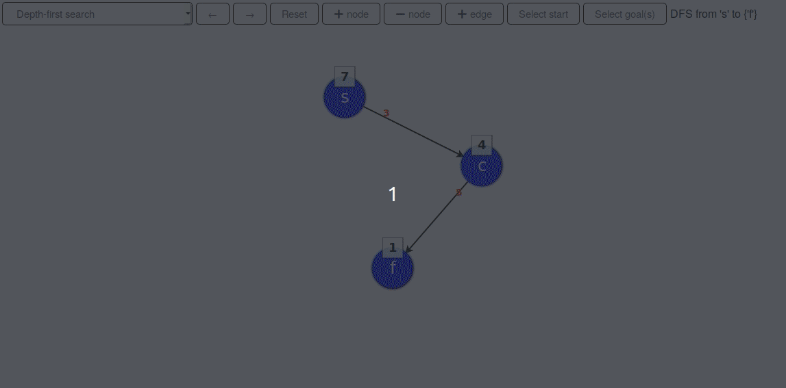

# Search visualizations

This is a **WIP** - here's a quick demo to see where this project is at currently.  

## What is this?
This repository contains visualizations (traces and additional notes) of several search algorithms:  
- depth-first search (DFS)
- breadth-first search (BFS)
- iterative deepening (IDDFS)
- A*

There is also accompanying logic for drawing your own graph, so that you can easily check how these algorithms would 
work on your example.

## Setup
1. Clone the repository.  
`$ git clone https://github.com/matejklemen/search-visualizations`  
2. Open up `src/index.html`.

## Usage
### General instructions
**Drawing a node**: click on the "+node" button, select the node location, input its heuristic value (must be a positive number) and then 
input its label (must be a unique string composed of characters only).  

**Drawing an edge**: click on the "+edge" button, select the source and destination nodes (click on them) and then input its weight 
(must be a positive number).  

**Removing a node**: click on the "-node" button and select the node to be removed. Note that removing a node also removes its incoming and 
outgoing edges and removes the node from starting or goal nodes (if node is there).  

**Selecting start/goal node(s)**: click on the "Select start" button and select the start node. Clicking on a node that is already among start 
nodes unmarks that node as start node. Same instructions apply for goal selection, with the exception that you are able to select multiple goal 
nodes.  

**Selecting the algorithm**: click on the left-most selection box and select your algorithm of choice.  

**Moving through the trace**: click on the buttons with left/right arrow keys on them to take a step forward or backward. You can also use the 
left and right arrow keys on your keyboard.  

**Resetting the trace**: click on the "Reset" button to clear focus effects and move to the start of the trace.  

### Additional notes
- After adding a node or edge, the trace needs to be reset. This is not automatically done because one can accidentally add a cycle that would cause the search algorithm to loop endlessly and if the algorithm immediately ran again, there would be no chance to fix this problem  
- Edges can currently only be removed by removing either node on the endpoints of that edge (removing a node also removes all of its in- and out-edges)  

## Examples
TODO: gifs of examples